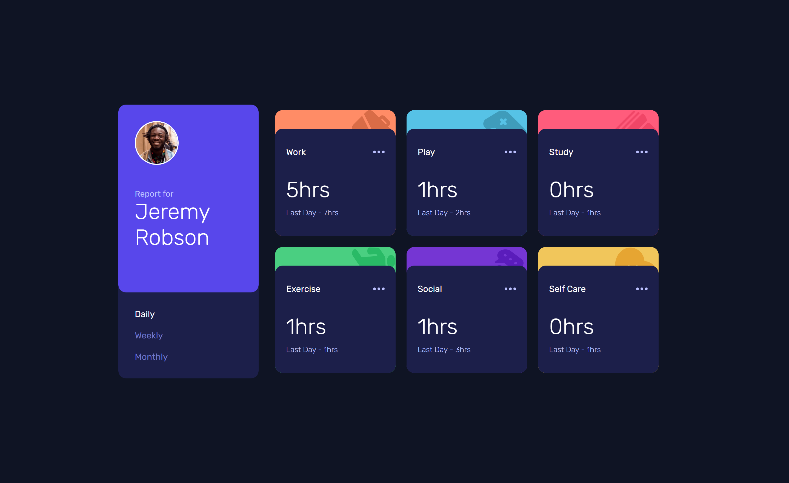
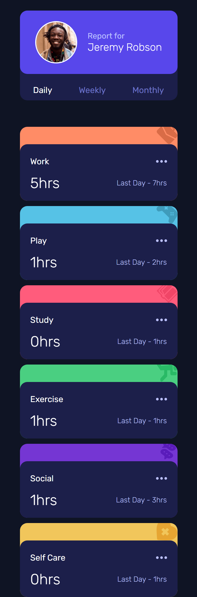

# Frontend Mentor - Time tracking dashboard solution

This is a solution to the [Time tracking dashboard challenge on Frontend Mentor](https://www.frontendmentor.io/challenges/time-tracking-dashboard-UIQ7167Jw). Frontend Mentor challenges help you improve your coding skills by building realistic projects. 

## Overview

### Links

- Solution URL: [Github](https://github.com/Affan840/Time-Tracking-Dashboard)
- Live Site URL: [Live Preview](https://affan840.github.io/Time-Tracking-Dashboard/)

### Screenshot

## Desktop

## Mobile

### Built with

- Semantic HTML5 markup
- CSS custom properties
- Flexbox
- JavaScript

## Author

- Instagram - [@muhammad__affan07](https://www.instagram.com/muhammad__affan07/)